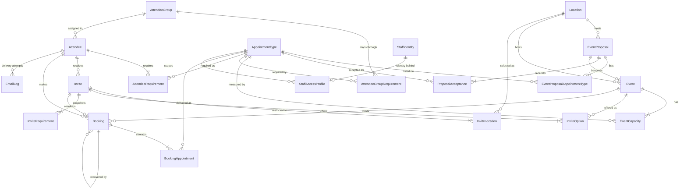
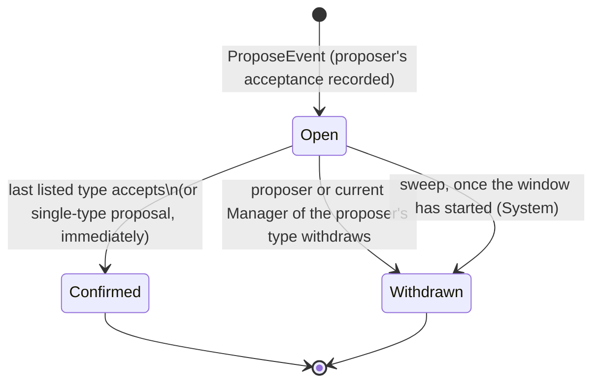
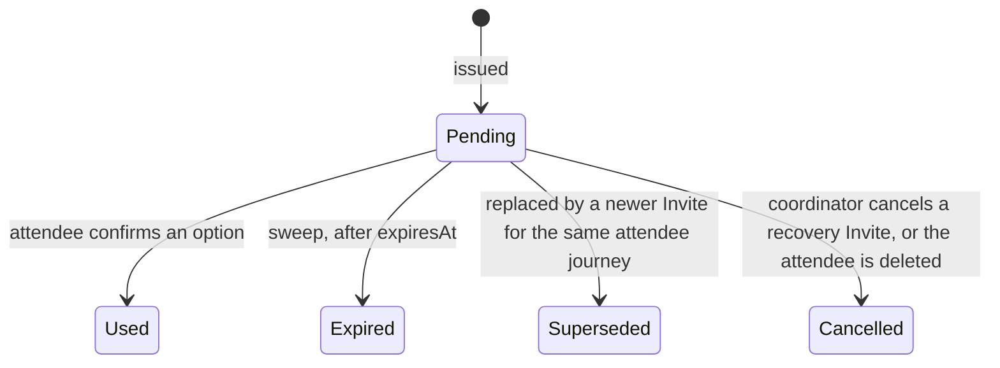
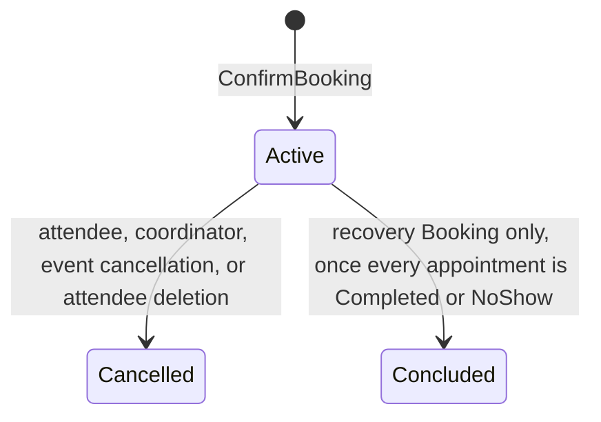
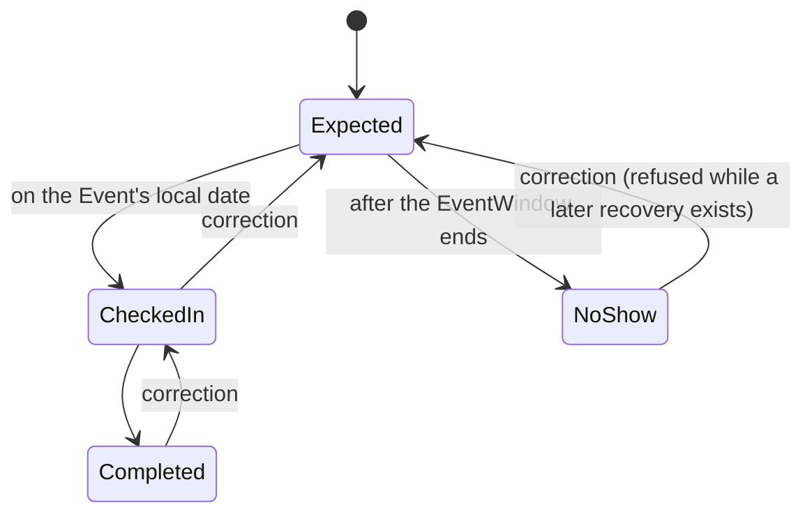

# 01 — Domain Model

[← Overview](00-overview.md) · [Functional requirements →](02-functional-requirements.md)

[docs/ontology.md](../ontology.md) is the canonical, CI-enforced list of every entity, value object,
enum, relationship and invariant, with its fields. This document does not repeat the field lists.
It adds what a table cannot show: the shape of the model, aggregate boundaries, lifecycles, and the
reasoning behind the invariants.

## Entity-relationship diagram

`AuditLog` and `SystemSettings` are omitted for legibility. `AuditLog` observes every mutable
entity, and `SystemSettings` is a single row.

## Aggregates

An aggregate is the unit loaded, changed and saved in one transaction by one command. A command
modifies exactly one aggregate, except where a cross-aggregate rule requires otherwise. Those
exceptions are listed under [Cross-aggregate transactions](#cross-aggregate-transactions).

| Aggregate root | Owns | Concurrency control |
|---|---|---|
| `Location` | — | Optimistic (`version`) |
| `AppointmentType` | — | Optimistic (`version`) |
| `AttendeeGroup` | `AttendeeGroupRequirement` | Optimistic (`version`) |
| `SystemSettings` | — | Optimistic (`version`) |
| `EventProposal` | `EventProposalAppointmentType`, `ProposalAcceptance` | Pessimistic: row lock on the proposal for every acceptance write |
| `Event` | `EventCapacity` | Pessimistic: row locks on `EventCapacity`, in ascending `appointmentTypeId` order |
| `Attendee` | `AttendeeRequirement` | Row lock on the attendee for every status-changing command |
| `Invite` | `InviteLocation`, `InviteOption`, `InviteRequirement` | Changed only inside commands that already hold the attendee lock |
| `Booking` | `BookingAppointment` | Booking: attendee lock. `BookingAppointment`: optimistic (`version`) |
| `StaffAccessProfile` | — | Optimistic (`version`) |
| `StaffIdentity` | — | Upsert by `staffUserId` |
| `AuditLog`, `EmailLog` | — | Append-only. `EmailLog` status updates are claimed with `FOR UPDATE SKIP LOCKED` |

### Lock ordering

When one command needs several locks, it always takes them in this order. The fixed order is what
makes deadlock impossible between commands:

1. the `Attendee` row;
2. the `EventProposal` row;
3. `Event` rows, in ascending `id`;
4. `EventCapacity` rows, by (`eventId`, `appointmentTypeId`) ascending.

The predecessor always touched exactly three capacity rows in a fixed order, so it never needed a
rule. With a variable number of types and overlapping subsets of them, it does.

### Cross-aggregate transactions

These commands span aggregates by necessity. Each is still one database transaction:

| Command | Aggregates touched |
|---|---|
| RecordAcceptance, when it completes the set | `EventProposal` → new `Event` with its `EventCapacity` rows |
| ConfirmBooking | `Attendee`, `Invite`, new `Booking`, `EventCapacity` |
| CancelBooking | `Attendee`, `Booking`, `EventCapacity`, and optionally a new `Invite` |
| CancelEvent | For each affected attendee in id order, in lock order: `Attendee`, `Event`, `EventCapacity`, then `Booking` and a new `Invite` |
| DeleteAttendee | `Attendee`, pending `Invite`s, active `Booking`s (original and recovery), `EventCapacity` |
| ReplaceAttendeeGroupRequirements | `AttendeeGroup`, each member's `AttendeeRequirement` and pending initial `Invite` |

## Lifecycles

### EventProposal and Event

When a proposal becomes `Confirmed`, it creates an `Event` in state `Active`.

```mermaid
stateDiagram-v2
    [*] --> Active: created by confirmation
    Active --> Cancelled: CancelEvent (before the window starts)
    Active --> [*]: window passes (stays Active; history)
```

An `Event` whose window has passed stays `Active`. "Past" is derived from the clock, never stored.

### Invite

### Booking

An original (non-recovery) `Booking` never becomes `Concluded`. It stays `Active` as the anchor
for `AttendeeReadiness`.

### BookingAppointment

### AttendeeStatus

`AttendeeStatus` describes the invitation journey only. Whether an attendee has *finished* is a
separate, calculated `AttendeeReadiness`. The table below lists every legal transition; any other
transition is a defect (decision D15).

| From | To | Trigger |
|---|---|---|
| `NotYetInvited` | `Invited` | An initial `Invite` is issued with the full `inviteOptionCount` options |
| `NotYetInvited` | `AwaitingAvailability` | An invite is attempted, but fewer eligible `Event`s exist than `inviteOptionCount` |
| `AwaitingAvailability` | `Invited` | The invite is re-attempted successfully |
| `Invited` | `Invited` | Automatic re-issue after expiry (`retryCount` + 1, `AttendeeReinvite` email) |
| `Invited` | `Booked` | The attendee confirms an option |
| `Invited` | `NoResponseNeedsFollowUp` | Expiry with `retryCount` at `maxAutoRetryCount`; automatic re-issue fails; or live options stay below `inviteOptionCount` after top-up |
| `NoResponseNeedsFollowUp` | `Invited` | The Coordinator re-invites successfully |
| `NoResponseNeedsFollowUp` | `AwaitingAvailability` | The Coordinator re-invites, but there are too few eligible events |
| `Booked` | `Invited` | The `Booking` is cancelled (by the attendee requesting a new time, by the Coordinator, or by event cancellation) and a replacement `Invite` is issued |
| `Booked` | `AwaitingAvailability` | As above, but a replacement is not possible |
| `Booked` | `NotYetInvited` | The attendee cancels without requesting a new time |
| any except `Booked` | `NotYetInvited` | A requirement-changing group reassignment supersedes the pending initial `Invite` |

Recovery `Invite`s and recovery `Booking`s never change `AttendeeStatus`. The attendee remains
`Booked`, and progress is visible through `AttendeeReadiness`.

## Invariants explained

The rules are stated tersely in the ontology. This section gives the reasoning.

### Capacity

`EventCapacity` holds a pair of numbers for each (`Event`, `AppointmentType`):

- `totalHeadcount` is what the Manager agreed;
- `remainingCapacity` is what is still unbooked.

Every operation that moves `remainingCapacity` is a delta applied under row lock:

| Operation | Delta |
|---|---|
| Booking | −1 on each `InviteRequirement` type |
| Cancellation | +1 on each type the `Booking`'s appointments hold |
| Recovery booking | −1 on each recovered type |
| Manager adjustment | `new total − old total`, applied to both numbers |

The database check constraint `0 <= remainingCapacity <= totalHeadcount` is the second layer. If a
logic defect ever computes a bad delta, the write fails instead of overbooking.

A booking charges only the types the attendee requires. An `Event` listing medical, fitting and
induction can host an attendee who needs only induction; the other two rows are untouched.

### Negotiation

- **The list is fixed at creation.** Changing the list after other Managers have accepted would
  make their headcounts refer to a different event. To change the offer, withdraw the proposal and
  propose again.
- **The proposer must list their own type, and their acceptance is recorded at creation.** A
  proposal nobody has committed to is noise, so the proposer commits in the same step.
- **Every listed type must have a current Manager at creation.** Otherwise the proposal could
  never confirm. If a listed type's Manager is later unassigned, the proposal waits. The next
  Manager assigned to that type inherits it. If nobody is assigned before the window starts, the
  sweep withdraws it.
- **Headcounts are private to each Manager.** A Manager sees which types have accepted, never how
  many places another team offered.

### Requirements

- `AttendeeRequirement` is always derived from the attendee's `AttendeeGroup`. Staff never tick
  types for an individual.
- Requirements cannot change while the attendee holds an active original `Booking`: the booking's
  `BookingAppointment`s were created from a snapshot. The rule applies to a single attendee's group
  change and to an Admin editing a group's mappings alike. A change that leaves the requirement set
  identical is always allowed.

### Time

- An `EventWindow` is local wall-clock time at its `Location`. The start and end instants are
  computed from `Location.timeZoneId` whenever they are needed. They are not domain data, so an
  event cannot disagree with its own location about when it happens. The one exception is a derived
  `start_utc` persistence column, kept only for indexing
  ([04](04-solution-architecture.md#invite-selection)).
- `durationMinutes` is a positive multiple of 15 and at most 720. The window must end on the local
  date it starts.
- A window whose start or end falls in a daylight-saving gap, or in an ambiguous overlap, is
  rejected at proposal time. This removes the only case where local time does not identify a
  unique instant.
- `Location.timeZoneId` cannot change while the location has open proposals or future active
  events.

| Rule | Evaluated as |
|---|---|
| "Window has started" | now ≥ start instant |
| "Window has ended" | now ≥ end instant |
| "On the event date" | The local date of now, in the location's zone, equals `date` |
| Past events in the workspace | End instant within the last 7 days |

### AttendeeReadiness

`AttendeeReadiness` is calculated at read time and never stored:

1. If there is no active original `Booking`, the code is `NoActiveBooking`.
2. If the original `Booking`'s `InviteRequirement` snapshot differs from the current
   `AttendeeRequirement` set, the code is `RequirementSnapshotMismatch`.
3. For each current requirement, find the latest non-cancelled `BookingAppointment` across the
   original `Booking` and its non-cancelled recovery `Booking`s:
   - if every requirement has a `Completed` attempt, the code is `Ready`;
   - otherwise the code is `AppointmentsOutstanding`, listing each outstanding type as an
     `OutstandingAppointmentType`, where `isRecoverable` is true when the latest attempt is `NoShow`.

### Recovery

- A recovery `Invite` covers only recoverable outstanding types: the latest attempt is `NoShow`
  and there is no `Completed` attempt.
- Recovery is anchored to the active original `Booking` (`recoveryOfBookingId`). At most one
  recovery is active at a time.
- Its `InviteLocation` defaults to the original `Booking`'s `Location`. The Coordinator may add
  more.
- A recovery `Booking` charges capacity only for the recovered types, and becomes `Concluded`
  when all of its appointments are terminal. A further no-show can start another recovery.
- Correcting `NoShow` back to `Expected` is refused while a later recovery `Invite` is pending, or
  a later recovery `Booking` is not cancelled, for that requirement. This prevents two recoveries
  for the same missed appointment.

### Reference data

- Codes (`Location.code`, `AppointmentType.code`, `AttendeeGroup.code`) are immutable, unique and
  canonical uppercase snake case. They are accepted case-insensitively on input and used as stable
  identifiers in CSV files, MCP tools and email ordering.
- Nothing in reference data is ever hard-deleted; it is deactivated. Deactivation is refused while
  the item is in live use:

  | Item | Refused while |
  |---|---|
  | `Location` | It hosts an `Open` proposal or a future `Active` event |
  | `AppointmentType` | It is listed on an `Open` proposal or future `Active` event, or mapped by an active group |
  | `AttendeeGroup` | It has members |

- An inactive `Location` or `AppointmentType` cannot be used on a new proposal. An inactive
  `AttendeeGroup` cannot be assigned to an attendee. Historical rows keep their references.
