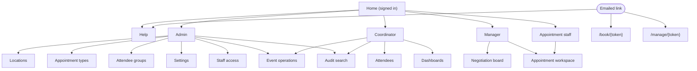

# 03a — Design System and Information Architecture

[← Functional requirements](02-functional-requirements.md) · [Screens and flows →](03b-screens-and-flows.md)

The staff front end is a Blazor WebAssembly application, ported from the predecessor. Everything in
this document is expressed as tokens, component contracts and layout rules. That keeps the design
re-skinnable, and it stays valid if the front end is ever replaced.

## Personas

| Persona | Ontology mapping | What they need |
|---|---|---|
| **Admin** | `Role` `Admin` (exclusive) | Set up locations, appointment types, groups, settings and staff scopes. Infrequent, high-trust use. Never sees attendee data |
| **Coordinator** | `Coordinator` | The heaviest user. Manages attendees end to end, chooses locations when inviting, watches dashboards, handles recovery and cancellations |
| **Manager** | `Manager`, scoped to one `AppointmentType` | Proposes events at any location, accepts peers' proposals with a headcount, adjusts capacity. Wants the fewest clicks to reach a confirmed event |
| **AppointmentStaff** | `AppointmentStaff`, scoped to one `AppointmentType` | At a desk on the day. Wants a roster and large check-in, complete and no-show controls |
| **Attendee** | Not a `Role`; authenticated by token | Uses the product once, often on a phone, sometimes not in their first language. Wants certainty ("did that work?") with no account |

One person can hold a union of roles, for example Coordinator and Manager. Navigation is the union
of everything the held roles grant; there is no switching between roles.

## Visual design system (neutral, decision D10)

### Tokens

| Token | Default | Use |
|---|---|---|
| `color.primary` | `#1f4e79` | App bar, primary buttons, links, focus ring |
| `color.primary.on` | `#ffffff` | Text on primary |
| `color.accent` | `#6b4fa3` | Scope highlight (the Manager's own type) |
| `color.danger` | `#b42318` | Destructive actions and errors; `Failed` and `NoShow` badges |
| `color.warning` | `#b54708` | Conflict, awaiting-confirmation and `Pending` states |
| `color.success` | `#067647` | Confirmations; `Completed` and `Sent` badges |
| `color.neutral.50–900` | Slate scale | Text, borders, surfaces |
| `space.*` | 4, 8, 12, 16, 24, 32, 48 px | All spacing |
| `radius.control` / `radius.card` | 4 px / 8 px | Controls / cards and tables |
| `font.body` | System UI stack | All text; no web font dependency |
| `font.size.body` / `font.size.label` | 14 px, line height 1.5 / 12 px, weight 600 | Body / table headers |

All tokens are CSS custom properties defined once. No colour is hard-coded in a component. A
deploying organisation re-skins by replacing `theme.css` in the web root: the web container serves
it as a separately mountable file, alongside an optional logo and a product name set in
`appsettings.json`. Every text and background pair meets WCAG 2.1 AA; re-check after
re-skinning.

### Component contracts

- **Status badge.** An enum value in display wording (never the raw member), coloured from one
  fixed map of enum value to colour, and always paired with its text.
- **Type chip.** An `AppointmentType` shown by `name`, with `code` in a tooltip. The same type
  always gets the same colour, generated deterministically from a hash of `code` over a palette
  that meets AA.
- **Data table.** Shows a loading skeleton and an actionable empty state. A row shows busy while
  its own action is in flight. Rows can be edited inline, one at a time. Lists use cursor
  pagination with "Load more". On tablet width and below, the table collapses to cards.
- **Dynamic type columns (new).** Wherever the predecessor had three fixed type columns, the table
  renders one column per listed type, in `code` order. Beyond 5 types it collapses to a single
  "Capacity" cell listing `code: remaining/total`, with the full breakdown in an expandable row.
- **Multi-select type picker (new).** A searchable checklist of active types. The caller's own type
  is pre-selected and locked. Types without a current Manager are disabled, with the reason shown.
- **Location picker (new).** Single-select when proposing an event, multi-select when inviting.
  Shows name, a short address and the zone abbreviation.
- **Two-step destructive control.** The first activation turns the control into an in-place
  confirmation that names the consequence (for example, "Cancels 3 bookings"). A second activation
  proceeds; navigating away or waiting 10 seconds resets it. It is never a native `confirm()`.
- **Banner.** One per page, in one of four variants: info, success, warning or error. A retryable
  failure offers "Retry".
- **CSV import result.** Success shows a count. A rejection shows line-numbered errors, followed by
  the explicit statement "Nothing was imported."
- **Time display (new).** Every event time is shown as local time at the event's location, with the
  zone abbreviation (for example, "Tue 14 Oct 2026, 09:30–11:00 BST"). Staff screens also show the
  location name next to every time.

### Accessibility baseline

- WCAG 2.1 AA as the minimum.
- Every action is keyboard-operable. Focus is never trapped except inside an intentional dialog,
  and is returned to a sensible place when the dialog closes.
- Background state changes are announced through an ARIA live region. These include a row
  refreshing after a conflict, and a banner appearing.
- Colour is never the only signal.
- Attendee pages meet the same bar, in plain language.

### Breakpoints

| Name | Width | Target |
|---|---|---|
| mobile | < 640 px | The attendee book and manage pages must be fully usable here |
| tablet | 640–1024 px | Staff screens use single-column cards |
| desktop | > 1024 px | The primary staff target |

## Information architecture

### Navigation matrix

| Screen | Admin | Coordinator | Manager | AppointmentStaff |
|---|:---:|:---:|:---:|:---:|
| Locations, Appointment types, Attendee groups | ✔ edit | read-only | read-only | |
| Settings | ✔ | | | |
| Staff access | ✔ | | | |
| Event operations | ✔ | ✔ | | |
| Attendees | forbidden | ✔ | | |
| Dashboards | forbidden | ✔ | | |
| Audit search | ✔ (event bucket) | ✔ (all buckets) | | |
| Negotiation board | | | ✔ | |
| Appointment workspace | | | ✔ (own type) | ✔ (own type) |
| Help | ✔ | ✔ | ✔ | ✔ (and anonymous) |

Page visibility is a convenience; the API is the authorization boundary. A page reached without
the capability it needs renders a forbidden state rather than redirecting. For Admin, "forbidden"
means the API refuses the attendee queries themselves, so the data cannot be reached even with a
hand-crafted request.

## Help

The Help screen embeds a role guide for each role (Admin, Coordinator, Manager, AppointmentStaff,
Attendee). The guides are Markdown files that ship in the web bundle. A signed-in user sees the
guide for every role they hold, with a contents list if there is more than one. An anonymous
visitor sees only the attendee guide. The guides are part of the definition of done for any
user-visible change ([08](08-nonfunctional-requirements.md#definition-of-done)).
