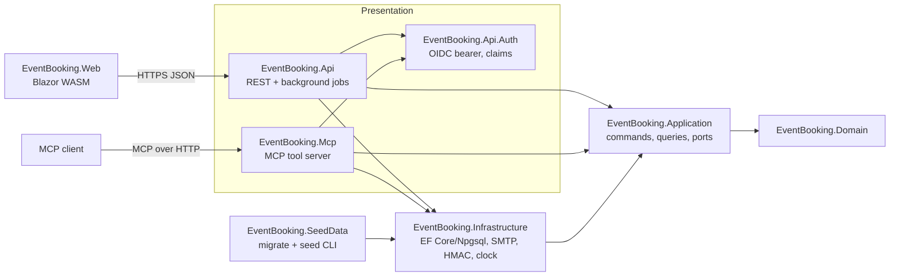

# 04 — Solution Architecture

[← Screens and flows](03b-screens-and-flows.md) · [API design →](05-api-design.md)

EventBooking is a .NET solution with Clean Architecture layering, ported from the predecessor and
generalised (decision D5). The target framework and package versions are pinned centrally in
`Directory.Build.props` and `Directory.Packages.props`.

## Layers and projects



| Project | Responsibility | Depends on |
|---|---|---|
| Domain | Entities, value objects, enums and invariants as code: an illegal transition is a method that refuses. No I/O and no framework | — |
| Application | One handler per use case. Commands run in one transaction; queries are read models that bypass aggregates. It defines the ports | Domain |
| Infrastructure | EF Core with Npgsql persistence, migrations, row-locking helpers, read-model SQL, the SMTP sender, the HMAC token service, the system clock, the outbox dispatcher and job locks | Application, Domain |
| Api.Auth | OIDC JWT bearer validation against a configurable authority; claim mapping to caller identity (subject, `staff_id`, `name`, `roles`) | Application |
| Api | Minimal-API endpoints, problem-details mapping, hypermedia links, OpenAPI, rate limiting, CORS, hosted background services | Application, Infrastructure, Api.Auth |
| Mcp | The MCP server: one tool per staff operation, calling the same handlers as Api | Application, Infrastructure, Api.Auth |
| Web | The Blazor WebAssembly staff and attendee UI, OIDC with PKCE, typed API clients, Help guides | — (talks to the API over HTTP only) |
| SeedData | A CLI that always applies migrations, then optionally seeds demo data, converges Keycloak demo users, and sends demo invitations | Infrastructure |

Test projects mirror these: Domain.Tests, Application.Tests, Infrastructure.Tests (Testcontainers
PostgreSQL), Api.Tests (WebApplicationFactory), Mcp.Tests, Web.Tests (bUnit) and SeedData.Tests.

The rule: dependencies point inward. Presentation calls Application, never repositories directly.
Web never shares an assembly with the server, only API contracts, which are duplicated as client
DTOs and checked by contract tests.

### Changes from the predecessor's layout

- The separate local-infrastructure and cloud-infrastructure projects are merged into one
  Infrastructure project, because there is only one implementation of each port.
- The cloud-specific authentication provider is removed. Api.Auth is provider-neutral OIDC, and
  the claim names are configuration.
- The serverless entry point for the sweep is removed. Background work runs as hosted services in
  the Api process.

## Ports (defined by Application, implemented by Infrastructure)

| Port | Contract |
|---|---|
| Repositories, one per aggregate root | Load with lock mode (none, update, or skip locked); add; save within the ambient unit of work |
| Unit of work | Opens one transaction per command, commits or rolls back, and exposes lock helpers that enforce the [lock order](01-domain-model.md#lock-ordering) |
| Read models | Parameterised SQL projections for lists, the board, dashboards, the workspace, readiness and audit search. Always keyset-paginated |
| Event eligibility | `FindEligibleEvents(requirements, locationIds, excludeEventIds, count, asOf)` returns event ids in order ([below](#invite-selection)) |
| Email sender | Sends one rendered message and returns an outcome: sent, transient failure or permanent failure. It never throws for a provider error |
| Email composer | Pure function from (`EmailTemplate`, context) to (subject, text, HTML) |
| Token service | Issues and validates the book and manage tokens ([06](06-security-and-authentication.md#attendee-authentication)) |
| Clock | Current UTC instant. Every time rule is tested with a fake clock |
| Time-zone resolver | Converts `EventWindow` and `timeZoneId` to start and end instants, and detects daylight-saving gaps and overlaps. Uses the IANA database (NodaTime) |
| Audit writer | Appends `AuditLog` in the current transaction |
| Caller context | The current caller's subject, `StaffId`, display name, token roles and resolved `StaffAccessProfile` |

## Commands, queries and transactions

Every command handler follows the same pattern:

1. Open the unit of work.
2. Take locks in the canonical order.
3. Load the aggregates.
4. Call the domain methods.
5. Write the audit entry.
6. Stage any `EmailLog` rows.
7. Commit.
8. Return a result DTO.

No domain entity leaves the handler.

Capacity changes use explicit row locks, because a booking must check several `EventCapacity`
rows together before writing any of them:

```sql
SELECT event_id, appointment_type_id, total_headcount, remaining_capacity
  FROM event_capacity
 WHERE event_id = @eventId AND appointment_type_id = ANY(@typeIds)
 ORDER BY appointment_type_id
   FOR UPDATE;
```

If any row has `remaining_capacity < 1`, the handler returns `capacity-exhausted` and rolls back.
Otherwise it decrements each row. The table carries the second, independent layer:

```sql
ALTER TABLE event_capacity
  ADD CONSTRAINT ck_event_capacity_bounds
  CHECK (remaining_capacity >= 0 AND remaining_capacity <= total_headcount AND total_headcount > 0);
```

Negotiation serialises on the proposal row (`SELECT … FROM event_proposal WHERE id = @id FOR
UPDATE`), with `UNIQUE (proposal_id)` on `event` as the backstop.

Optimistic concurrency uses the `version` column (EF concurrency token) on these entities:

- `Location`, `AppointmentType`, `AttendeeGroup` and `SystemSettings`;
- `StaffAccessProfile`;
- `BookingAppointment`.

A mismatch maps to 409 with the current state.

## Invite selection

Selection is a relational-division query: an event qualifies only if it covers every required type
with at least one place left. It is executed in the database:

```sql
SELECT e.id
  FROM event e
  JOIN location l ON l.id = e.location_id
  JOIN event_capacity c ON c.event_id = e.id
                       AND c.appointment_type_id = ANY(@requiredTypeIds)
                       AND c.remaining_capacity >= 1
 WHERE e.status = 'Active'
   AND e.location_id = ANY(@locationIds)
   AND e.start_utc > @now
   AND e.id <> ALL(@excludeEventIds)
 GROUP BY e.id, e.start_utc
HAVING COUNT(*) = cardinality(@requiredTypeIds)
 ORDER BY e.start_utc, e.id
 LIMIT @count;
```

`start_utc` is a **derived persistence column**, not domain data. The application writes it in the
same transaction that inserts the `Event`, computing it from `date`, `startTime` and the location's
zone. It is not a database-generated column, because PostgreSQL cannot evaluate IANA rules in a
generated column deterministically. It exists only for indexing and ordering, and the domain never
reads it as the source of truth. It is safe because
`Location.timeZoneId` cannot change while the location has future events (FR-1.2). An index on
(`status`, `location_id`, `start_utc`) supports the query.

The query only proposes candidates. Capacity is re-checked under lock at booking time, so a stale
option can never overbook.

## Notification outbox

This settles an open question in the predecessor (decision D13):

1. A command that must email someone inserts an `EmailLog` with status `Pending`, template and
   context ids, and commits it together with the business change. No email is sent inside a
   transaction.
2. The dispatcher runs as a hosted service and wakes every 5 seconds, or on an in-process signal
   after a commit. It claims a batch:
   ```sql
   UPDATE email_log SET claimed_at = @now
    WHERE id IN (SELECT id FROM email_log
                  WHERE status = 'Pending' AND (claimed_at IS NULL OR claimed_at < @now - interval '5 minutes')
                  ORDER BY id LIMIT 20 FOR UPDATE SKIP LOCKED)
   RETURNING id;
   ```
3. For each claimed row, the dispatcher regenerates the message from its context ids, reproducing
   the current link deterministically from the `Invite` or `Booking` version, sends it, and records
   the result:
   - `Sent`, with `sentAt`, auditing `InviteSent` where relevant;
   - on a transient failure, the row stays `Pending` for up to 3 claims with backoff, then becomes
     `Failed`;
   - on a permanent failure, `Failed`.
4. A staff retry (FR-11.3) creates a new `Pending` row and marks the old one `Resolved`. The resent
   email carries the same link as the original.

The dispatcher never stores the token, URL or body. Links are reproduced at send time from the
entity's id and version. See [06](06-security-and-authentication.md#attendee-authentication).

## Background jobs

| Job | Schedule | Work | Guard |
|---|---|---|---|
| Invite sweep | Every 15 minutes | Expire and re-issue invites (FR-5.6, 5.7); withdraw started proposals (FR-2.12); conclude recovery bookings (FR-9.5) | `pg_try_advisory_lock(<sweep key>)`. Skips the run if the lock is held. Each item is processed in its own transaction |
| Outbox dispatcher | Continuous (5-second poll plus signal) | Sends pending email | `SKIP LOCKED` claims, so it is safe with any number of replicas |

Both jobs run as .NET hosted services in the Api container. The home-lab and local deployments run
long-lived containers, so no external scheduler is needed; the predecessor's serverless constraint
no longer applies. The Mcp container runs neither job.

## Configuration

Configuration uses standard .NET binding. Environment variables use `__` separators. Settings
marked † must be supplied and have no default; startup fails if they are missing or placeholder
values.

| Key | Meaning |
|---|---|
| `ConnectionStrings__EventBooking` † | PostgreSQL connection string (application user, not the owner) |
| `Auth__Authority` † / `Auth__Audience` † | OIDC issuer and expected audience |
| `Auth__Claims__StaffId` (default `staff_id`), `__Name` (`name`), `__Roles` (`roles`) | Claim names |
| `Identity__StaffIdPattern` | Default `^[A-Z0-9]{1,32}$` |
| `Tokens__SigningKey` † | At least 32 bytes, base64. Known placeholders are rejected |
| `Email__Smtp__Host` †, `__Port`, `__UseTls`, `__Username`, `__Password`; `Email__FromAddress` †, `Email__FromName` | SMTP |
| `Portal__BaseUrl` † | The public web origin used in emailed links |
| `Portal__CoordinatorContact` † | The contact shown in emails and on the manage page |
| `Cors__AllowedOrigins` † | The web origin or origins |
| `RateLimiting__AttendeePerMinute` (default 30) | See [06](06-security-and-authentication.md#rate-limiting) |
| `Jobs__SweepInterval` (default 00:15:00) | Invite sweep schedule |

The predecessor's head-office address and time-zone settings are gone: both now live on `Location`.

## Testing strategy

| Level | What it proves | Tooling |
|---|---|---|
| Domain unit | Every invariant and state transition, `EventWindow` validation including daylight-saving gaps and overlaps, readiness calculation, N-type confirmation | xUnit, fake clock |
| Application | Handlers against in-memory ports: authorization gates, audit emitted, outbox rows staged, status transitions per [01](01-domain-model.md#attendeestatus) | xUnit |
| Infrastructure | Real PostgreSQL: migrations, the check constraint, the selection query, lock ordering. **Concurrency harness**: N parallel bookings over overlapping type subsets never overbook and never deadlock; concurrent final acceptances create exactly one `Event`; a capacity adjustment racing a booking stays consistent | Testcontainers |
| API | Endpoint contracts, the problem-details catalogue, authorization matrix, rate limits, OpenAPI snapshot | WebApplicationFactory |
| MCP | Parity with OpenAPI; list tools return ids | MCP client harness |
| Web | Components: dynamic type columns, type and location pickers, two-step controls, conflict states, accessibility checks | bUnit plus an axe-core run in Playwright |
| Seed | The demo dataset covers every axis listed in [07](07-deployment.md#seed-data) | xUnit |
