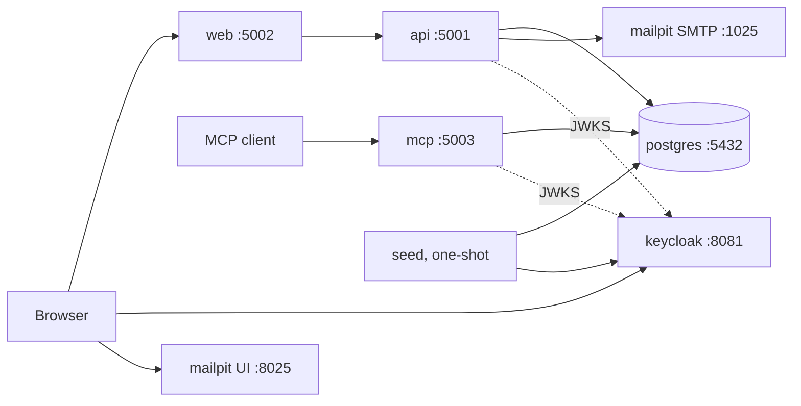
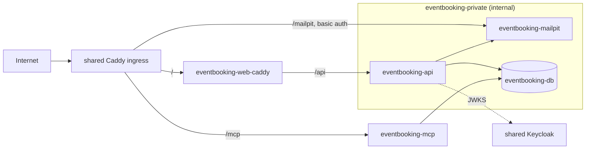

# 07 — Deployment

[← Security and authentication](06-security-and-authentication.md) · [Non-functional requirements →](08-nonfunctional-requirements.md)

EventBooking ships as containers. Two deployment shapes are supported:

- **local**, for development and demonstrations on one machine;
- **home lab**, for a self-hosted server behind an existing reverse proxy and identity provider.

No cloud provider is targeted (scope).

## Images

GitHub Actions builds and publishes every image to GHCR on each push to `main` (tag `latest` and
`sha-<short>`) and on each version tag (`vX.Y.Z`):

| Image | Contents |
|---|---|
| `eventbooking-api` | ASP.NET Core runtime; the API plus hosted background jobs |
| `eventbooking-mcp` | ASP.NET Core runtime; the MCP server |
| `eventbooking-web` | nginx serving the Blazor WebAssembly bundle, for local use |
| `eventbooking-web-caddy` | Caddy serving the same bundle, with security headers, SPA fallback and `/api` and `/mcp` reverse proxy, for the home lab |
| `eventbooking-seed` | The SeedData CLI: migrate, seed, and Keycloak convergence |

Every image runs as a non-root user and builds from a `.dockerignore`-filtered context. A release
also attaches a self-contained EF Core migrations bundle, for hosts that migrate without the SDK.

## Local (`docker-compose.yml` at the repository root)



| Service | Image | Notes |
|---|---|---|
| postgres | `postgres:16-alpine` | Database `eventbooking`; named volume; health check with `pg_isready` |
| keycloak | `quay.io/keycloak/keycloak:26.x`, `start-dev --import-realm` | Imports `deploy/keycloak/realm-export.json`, the `eventbooking` realm |
| mailpit | `axllent/mailpit` | Catches all email; UI on 8025 |
| api, mcp, web | Built from source, or `ghcr.io/…/eventbooking-*:${EVENTBOOKING_IMAGE_TAG:-latest}` | Development-only settings inline (a local signing key, `Portal__BaseUrl=http://localhost:5002`) |
| seed | `eventbooking-seed`, profile `seed` | `docker compose --profile seed run --rm seed [--reseed] [--reanchor]` |

To bring the stack up:

```bash
docker compose up -d postgres keycloak mailpit
docker compose --profile seed run --rm seed
docker compose up -d
```

## Home lab (`deploy/home-lab/`)

The home lab assumes a host that already runs:

- a shared **Caddy** ingress, on an external Docker network (default name `edge`, configurable as
  `EVENTBOOKING_EDGE_NETWORK`);
- a shared **Keycloak** instance, reachable at `EVENTBOOKING_KEYCLOAK_URL`.

EventBooking brings its own database and Mailpit.



| File | Purpose |
|---|---|
| `docker-compose.yml` | Services `eventbooking-db`, `eventbooking-mailpit`, `eventbooking-api`, `eventbooking-mcp`, `eventbooking-web` and `eventbooking-seed` (profile `seed`). The network `eventbooking-private` is `internal: true`; the edge network is external |
| `web/Caddyfile`, `web/Dockerfile`, `web/appsettings.json` | The web container: SPA fallback, security headers, `/api` proxied to the API, and the mountable `theme.css` |
| `caddy/eventbooking.caddy` | Fragment for the shared ingress, routing the hostname to the web and MCP containers, plus `/mailpit` with basic auth |
| `keycloak/eventbooking-realm.json` | Realm definition: client, roles, mappers. It contains the `EVENTBOOKING_HOSTNAME` placeholder |
| `seed/Dockerfile` | The seed image build |
| `README.md` | Operator instructions (below) |

Installing on a host needs the steps below. The repository documents them, and ships an optional
reference script, `deploy/home-lab/install.sh`. An operator's own automation may replace it; it
must perform the same steps.

1. Clone the repository, or pull the images with a pinned `EVENTBOOKING_IMAGE_TAG`.
2. Create `deploy/home-lab/.env` from `.env.example`, with generated secrets.
3. Substitute `EVENTBOOKING_HOSTNAME` into the realm file and the Caddy fragment.
4. Create the Keycloak realm from the realm file, once.
5. Install the Caddy fragment and reload the ingress.
6. Run `docker compose --profile seed run --rm eventbooking-seed`. It always migrates first. Seeding
   of demo data happens only with `--demo` (below).
7. Run `docker compose up -d`.

| Variable | Purpose |
|---|---|
| `EVENTBOOKING_HOSTNAME` | Public host name |
| `EVENTBOOKING_IMAGE_TAG` | Image tag to run (default `latest`) |
| `EVENTBOOKING_DB_PASSWORD`, `EVENTBOOKING_DB_APP_PASSWORD` | Migration-owner and application-role passwords |
| `EVENTBOOKING_TOKENS_SIGNING_KEY` | At least 32 random bytes, base64 |
| `EVENTBOOKING_KEYCLOAK_URL` | Keycloak base URL |
| `EVENTBOOKING_KEYCLOAK_SEED_ADMIN_USERNAME`, `EVENTBOOKING_KEYCLOAK_SEED_ADMIN_PASSWORD` | Used only by the seed container, to converge demo users |
| `EVENTBOOKING_KEYCLOAK_DEMO_PASSWORD` | Password given to newly created demo users |
| `EVENTBOOKING_SMTP_*` | Optional real SMTP relay. When unset, mail goes to Mailpit |
| `EVENTBOOKING_EDGE_NETWORK` | Name of the shared ingress network |
| `EVENTBOOKING_MAILPIT_BASIC_AUTH` | Caddy basic-auth hash for `/mailpit` |

### Upgrades and rollback

- **Upgrade:** set the new `EVENTBOOKING_IMAGE_TAG`, run `pull`, run the seed container (which
  migrates), then `up -d`.
- **Migrations are forward-only.** A migration must stay compatible with the previous image for one
  release (expand, then contract) so that rollback means only running the previous tag.
- **Backup:** a nightly `pg_dump` to a host path, via an optional `eventbooking-backup` service in
  the Compose file, retaining 14 days. Restore is `pg_restore` into a fresh volume. See
  [08](08-nonfunctional-requirements.md#reliability).

## Seed data

The SeedData CLI takes these options:

| Option | Effect |
|---|---|
| (none) | Apply migrations only. Safe on any environment (carried hardening: never seed or send email by default) |
| `--demo` | Also upsert the demo dataset, matched by natural key so that re-running is idempotent; converge Keycloak demo users and roles when Keycloak settings are present; send demo invitations through the configured SMTP (Mailpit) |
| `--reanchor` | Shift demo event dates relative to today |
| `--reseed` | Destructive: wipe the domain tables and recreate the `eventbooking` Keycloak realm from the realm file, then seed. Refused unless `--demo` is also given and `EVENTBOOKING_ALLOW_RESEED=true` |

The demo dataset exercises every generalised axis:

- **3 `Location`s:** two in `Europe/London` and one in `Europe/Dublin`. One London location is
  inactive.
- **5 `AppointmentType`s:** MED, FIT, IND, ESC and DOC. ESC is active but has no Manager, to
  demonstrate the disabled picker state. DOC is inactive.
- **4 `AttendeeGroup`s:**
  - one requiring IND only;
  - one requiring MED, FIT and IND;
  - one requiring MED and DOC, which is inactive, to demonstrate the blocked-deactivation state;
  - one requiring FIT and ESC, for which no event can ever be created while ESC has no Manager, to
    demonstrate `AwaitingAvailability`.
- **Events** of 60, 90, 240 and 480 minutes, listing 1 to 4 types, across both zones. The dates
  include one event on the day of a daylight-saving change.
- **Open proposals** at 1 of 2 and 2 of 4 accepted.
- **Attendees** in every `AttendeeStatus`, with bookings in every `BookingAppointmentStatus`, plus
  one completed recovery and one pending recovery.
- **Keycloak demo users:**
  - one Admin;
  - one Coordinator;
  - one Coordinator who is also Manager of MED;
  - Managers of FIT and IND;
  - two AppointmentStaff, one of them unscoped to demonstrate the awaiting-assignment state.

## CI/CD

| Workflow | Trigger | Does |
|---|---|---|
| `dotnet-build.yml` | Pull requests and pushes to `main`; skipped for docs-only changes | Restore, build with warnings as errors, and run every test project, with Testcontainers for PostgreSQL |
| `ontology-lint.yml` | Every pull request and push to `main` | Ontology build `--check` and the term check |
| `images.yml` | Pushes to `main` and version tags | Build and push the five images; attach the migrations bundle to a release |
| `compose-smoke.yml` | Pull requests touching `deploy/` or `docker-compose.yml` | `docker compose config` for both Compose files; bring up the local stack, run the seed with `--demo`, and probe `/health/ready` and `/api` |
| `ai-fingerprint.yml`, narrative workflows | As defined in [AGENTS.md](../../AGENTS.md) | Repository governance |

Every third-party action is pinned by commit SHA.
