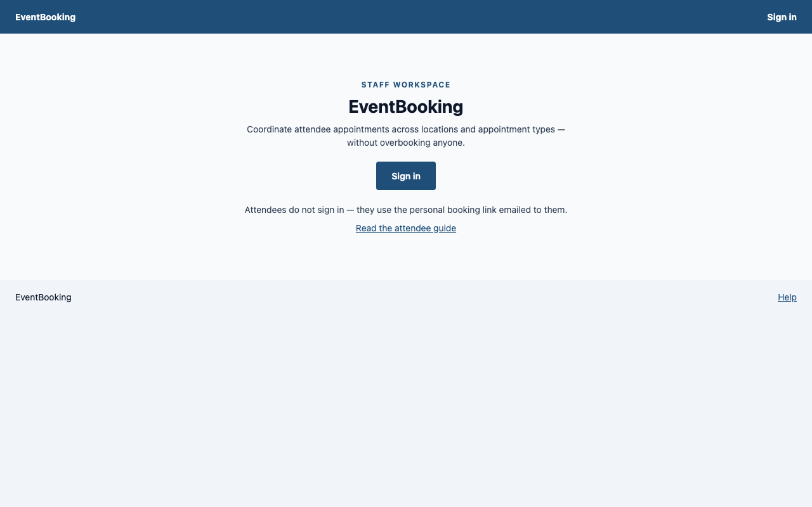
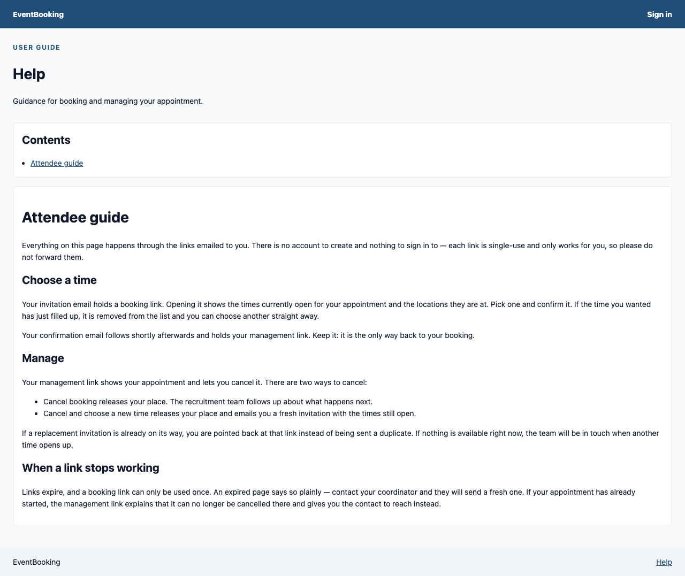

# EventBooking user acceptance pack

Use these scripts at [the home-lab EventBooking site](https://eventbooking.tqaentry.com/) to learn the product and record whether each role can complete its work. The scripts describe the current web pages; the longer [user guides](../user-guides/README.md) give background. Work through the roles in this order when testing one complete journey: Admin, Manager, Coordinator, Attendee, Appointment staff, then Coordinator again for readiness.

| Role | Script | Main question |
| --- | --- | --- |
| Admin | [Admin acceptance](admin.md) | Can I prepare reference data, settings and staff scope without seeing attendee data? |
| Manager | [Manager acceptance](manager.md) | Can I agree an event and control capacity for my own appointment type? |
| Coordinator | [Coordinator acceptance](coordinator.md) | Can I add, invite and follow up an attendee? |
| Attendee | [Attendee acceptance](attendee.md) | Can I book and manage a visit from my private email link? |
| Appointment staff | [Appointment staff acceptance](appointment-staff.md) | Can I find my roster and record the correct outcome? |

## Before anyone starts

The test lead should supply role-specific staff accounts, a test mailbox that receives invitations, and a named set of disposable records. A staff member signs in with the company identity provider; an attendee does not sign in. The test lead should also confirm that the deployment contains suitable future events and that the invitation mailbox is accessible. The demo seed is optional and its event dates can become stale, so choose records by their visible status and date rather than assuming a named example is present.

Record the site version or deployment tag, date, tester, browser and device, test account role, and any test record names. Use a unique prefix such as `UAT-2026-09-25-AB` for new records, and use only a test mailbox you control. Never paste booking or management links, passwords, attendee addresses or a downloaded roster into a public issue. For a failure, record the script ID, step, expected and actual result, time, and a redacted screenshot if useful.

Each case has a **Result** line for Pass, Fail, Blocked or Not run. Mark **Blocked** when its precondition is missing; do not force a state change on another tester's record. A case can be run on its own when its preconditions are met. The steps that save, invite, book, cancel, or change appointment status alter the home-lab data; run them only against records reserved for this acceptance run. Do not delete records to tidy up: deletion can remove evidence, and test data can be reset by the deployment operator after the run.

## Live deployment check

The [review after the UI redeployment](live-review-2026-09-25-after-ui-fixes.md) found that the signed-out landing page is styled and has no visible error strip. The identity-provider handoff and invalid-link messages still work. Anonymous Help still fails, and no signed-in role journey has yet been verified. The [earlier review](live-review-2026-09-25.md) records the presentation faults seen before the UI fixes. Recheck the smoke test before each session and record actual results against the cases below.

The [local Docker review after reseeding](local-review-2026-09-25.md) exercises the demo accounts and one attendee booking at [localhost:5002](http://localhost:5002/). It found that public Help works locally but signed-in Help misidentifies staff as having no role. The local result does not replace the home-lab result above; repeat the scripts on the target deployment.

### Smoke check — UAT-00

1. Open [EventBooking](https://eventbooking.tqaentry.com/) in a fresh browser session. **Expect:** an EventBooking landing page with **Sign in** and **Read the attendee guide**; no unhandled-error banner.
2. Open [Help](https://eventbooking.tqaentry.com/help) while signed out. **Expect:** the attendee guidance loads without requiring a staff sign-in.
3. Have one test staff account select **Sign in**. **Expect:** the company identity provider returns the user to a home page showing their roles and, for a scoped role, the appointment type.

**Reference screens (local demo build):**

*Signed-out landing page.*

*Public Help while signed out.*

**Result:** Pass / Fail / Blocked / Not run

**Actual result and evidence:** ____________________

## Screenshots

Each case shows reference screens in [`screenshots/`](screenshots/), captured on 2026-09-25 from the local Docker demo build (seeded with `--demo --reanchor`) at 1280 px wide, full page; the mobile shots are 375 px. They show what a passing page should broadly look like, using demo data; the home-lab site will differ in records and dates. One thing visible in them is a fault, not expected appearance: signed-in Help tells the Admin account it has no assigned role. The invitation booking shown in ATT-01 changed local demo data (Nia New now holds a 4 October booking).

## Exploratory questions for every role

After the scripted checks, spend five minutes using only the visible links and Help page. Note labels that are unclear, actions that cannot be found, surprising data, keyboard or mobile problems, and messages that do not tell the user what to do next. Record a concrete example and the page where it happened. An empty list is a valid outcome.

## Source and scope

These cases follow the [application ontology](../ontology.md), [functional requirements](../design/02-functional-requirements.md), [screens and flows](../design/03b-screens-and-flows.md), [home-lab deployment notes](../../deploy/home-lab/README.md), and the current pages in `src/EventBooking.Web/Pages`. Visible labels and routes come from the current page code and are updated where the live review provides direct evidence. Some longer user guides still describe earlier screens; use these scripts for the current acceptance run.
