# Attendee acceptance script

[← Acceptance pack](README.md) · [Attendee guide](../user-guides/attendee-guide.md)

**You are checking:** the private booking journey, preferably on a phone as well as a desktop browser. Use a fresh invitation sent to a test mailbox you control. The Coordinator should reserve the attendee and event options for this run. You do not need a staff account.

## ATT-01 — Choose and confirm a time

1. Open the **Choose a time** link in the test invitation email. **Expect:** your name, required appointments, and one or more future options showing Location, address, local date, time and time zone. If the name or appointments are wrong, stop and tell the Coordinator.
2. Select one option. **Expect:** **Confirm this time** becomes available. Before selecting it, check that the window and site are workable for you.
3. Select **Confirm this time** once. **Expect:** **Booking confirmed**, the chosen site and window, and **Use your booking management link**. Save the management link privately; the confirmation email should also arrive.
4. Return to the invitation link in a separate tab. **Expect:** **This link has expired.** and no option to create another booking. Record the screen wording without sharing the token.

**Reference screens (local demo build):**

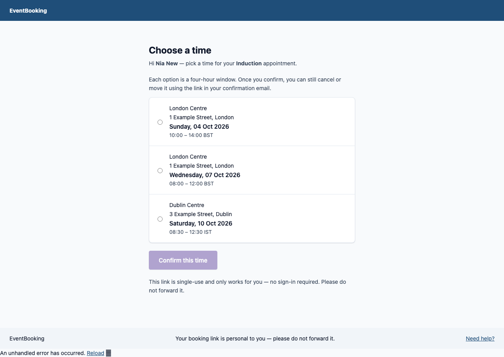
*Invitation page listing offered times.*

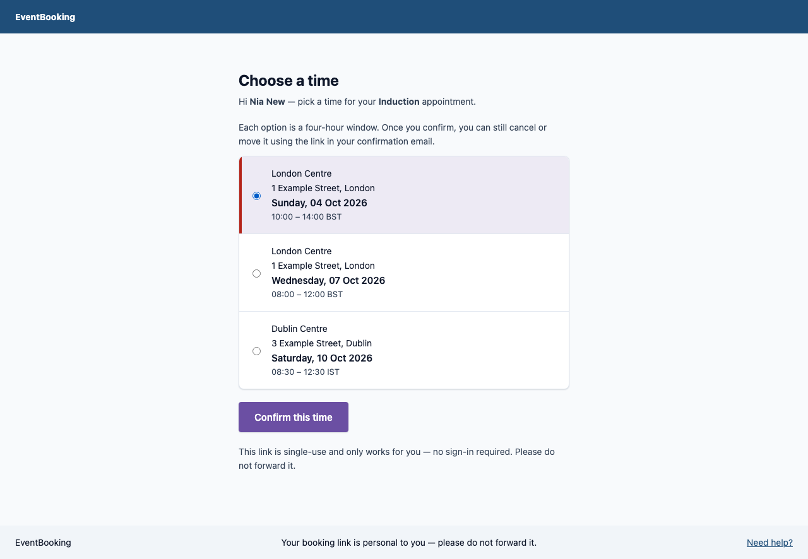
*A time selected, Confirm this time enabled.*

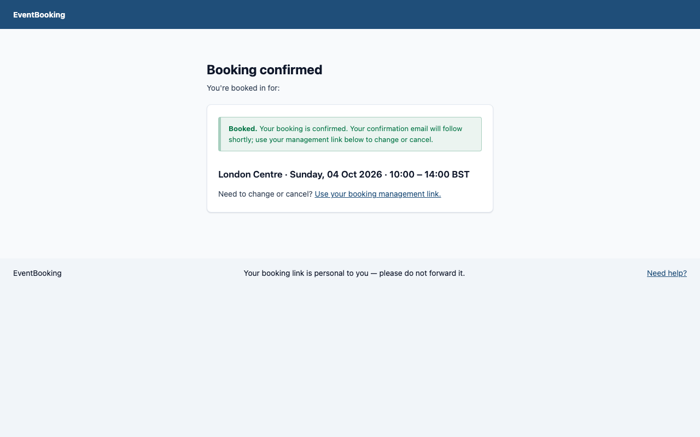
*Booking confirmed.*

**Result:** Pass / Fail / Blocked / Not run

**Chosen window and evidence:** ____________________

## ATT-02 — Review and change a reserved booking

1. Open the private management link from ATT-01. **Expect:** **Manage your booking** shows your name, Location, address, window and appointment types.
2. For a booking reserved for rescheduling, select **Cancel and choose a new time**. **Expect:** **Booking cancelled** and a message saying whether a fresh invitation is on its way, already pending, or unavailable. The old booking must no longer stand.
3. If a fresh invitation arrives, open it and choose another time using ATT-01. **Expect:** one new booking, with its own management link. If no suitable time exists, the page should explain that the team will follow up.
4. On a separate reserved booking, use **Cancel booking**. **Expect:** **Booking cancelled** without an automatic request for replacement times. This step is Not run if no second reserved booking exists.

**Reference screens (local demo build):**

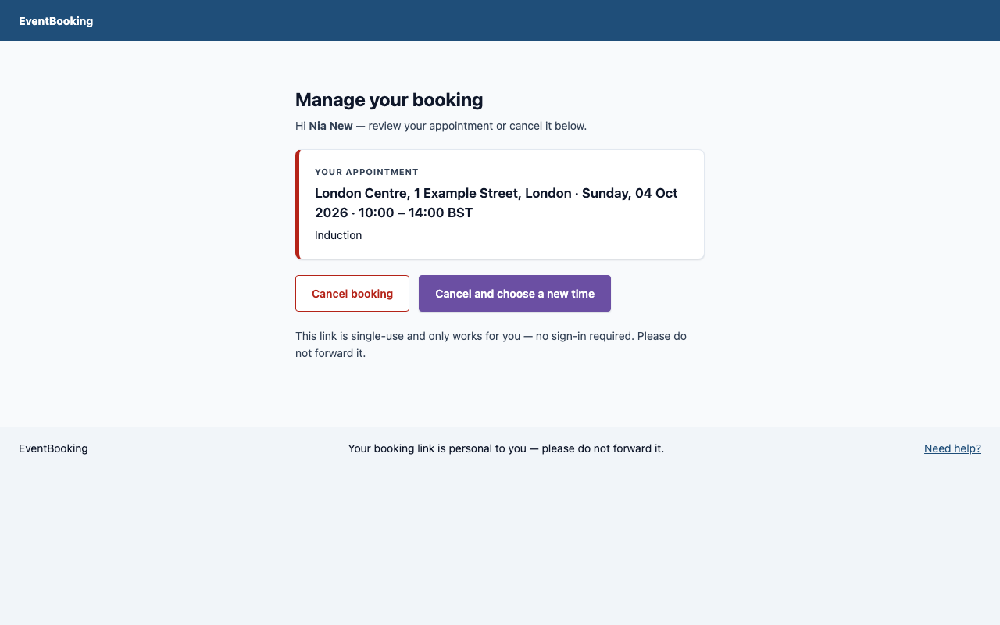
*Manage your booking.*

**Result:** Pass / Fail / Blocked / Not run

**Cancellation outcome and evidence:** ____________________

## ATT-03 — Explore link and mobile behaviour

1. Open [Help](https://eventbooking.tqaentry.com/help) while signed out. **Expect:** attendee guidance without staff navigation.
2. With a test link known to be expired or invalid, open the link. **Expect:** an invitation link says **This link has expired.**; an invalid management link says **This link has expired** and **This booking link is no longer valid.** Both direct you to the Coordinator contact. Never test this by editing a real person's token.
3. Repeat the invitation review on a phone-sized screen. **Expect:** all options, addresses, buttons and messages can be read and used without horizontal scrolling. Try keyboard focus or a screen reader if available, and record where the next action is unclear.

**Reference screens (local demo build):**

*A reused invitation link.*

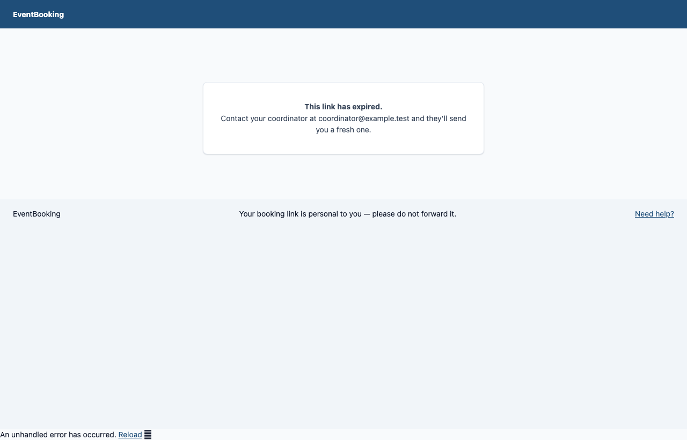
*An invalid link.*

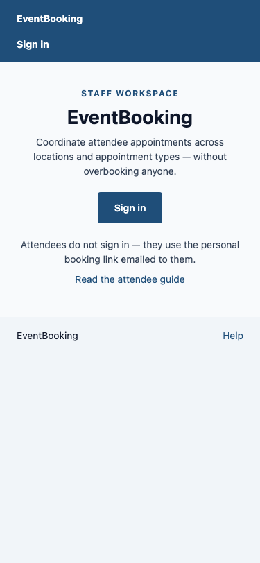
*Landing page at 375 px wide.*

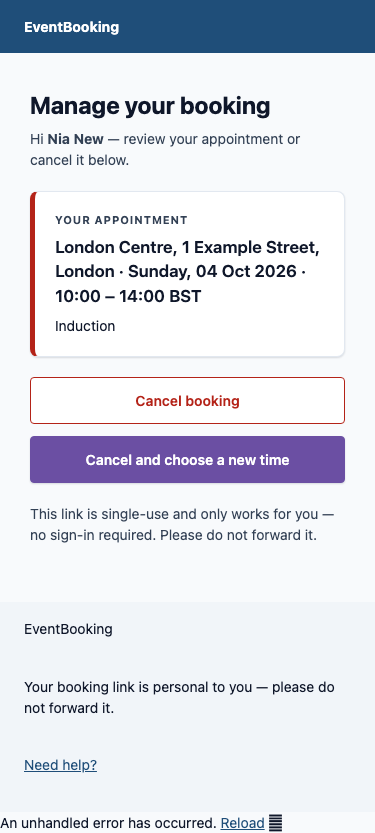
*Manage booking at 375 px wide.*

**Result:** Pass / Fail / Blocked / Not run

**Device, accessibility observations and evidence:** ____________________

## ATT-04 — Register yourself from a group page

Needs a shareable link from the Coordinator (COO-07) and a test mailbox you control. No invitation is required.

1. Open the group link. **Expect:** the group title and description, then open events showing place, address, date and start time, with no capacity figures. A closed or unknown group says it is no longer open and shows the Coordinator contact.
2. Select an event. **Expect:** the event's place, time and appointment types, and **Full name**, **Email address** and **Your group** fields. The page states that sending the request does not hold a place.
3. Leave a field empty and select **Send request**. **Expect:** an accessible error and the other entries kept.
4. Enter the test name and mailbox, choose a group, and select **Send request**. **Expect:** **Check your email**, with the same wording for a new or an already-requested address. Repeat the request once. **Expect:** the same wording, and no second confirmation email arrives immediately.
5. Open the emailed link. **Expect:** the group title, place, date, start time and your group, with **Confirm my place**. Select it once. **Expect:** **Your place is booked** and a booking-confirmation email with a management link.
6. Reopen the confirmation link. **Expect:** it reports that your place is booked and creates no second booking. Open the management link and confirm it shows the booking.
7. With a link known to be expired or malformed, open it. **Expect:** an error with the Coordinator contact, and no token in the page text. Never edit a real person's token to test this.

**Reference screens (local demo build):**

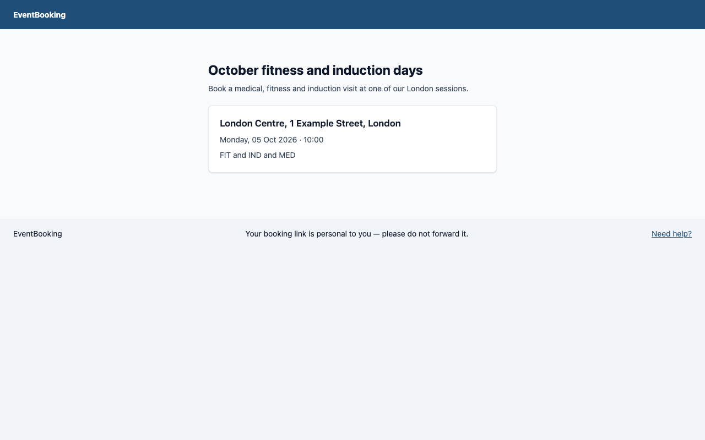
*Public event group.*

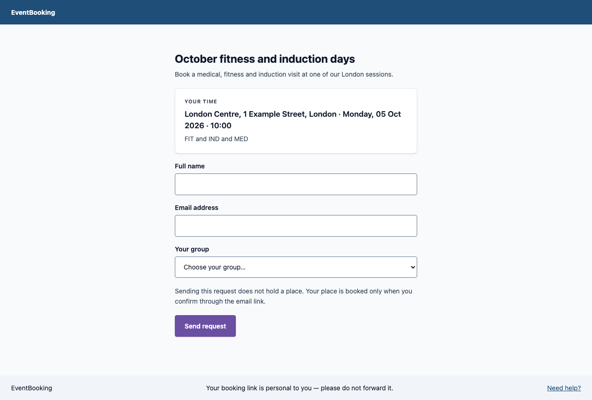
*Request form.*

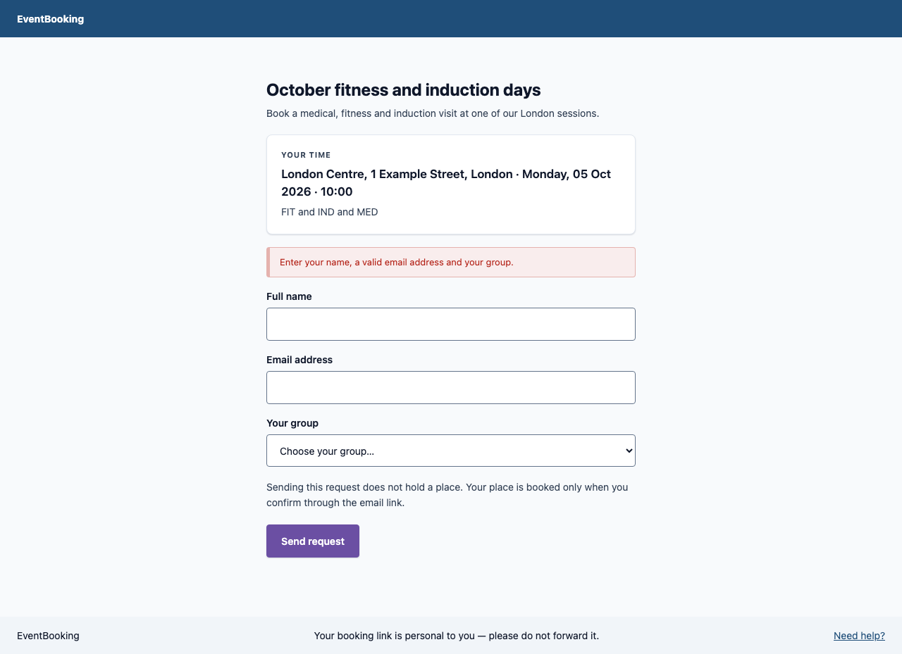
*Validation error.*

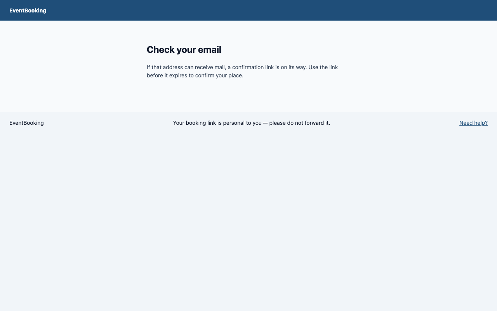
*Request sent.*

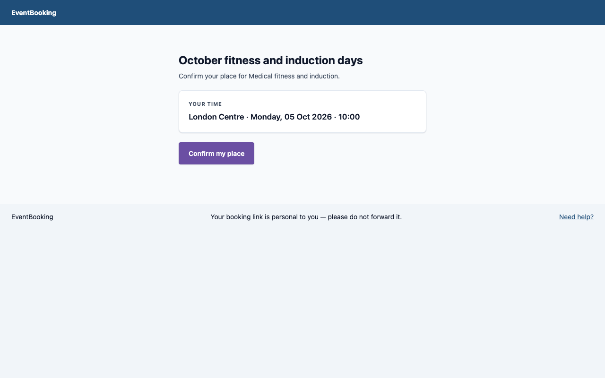
*Confirm my place.*

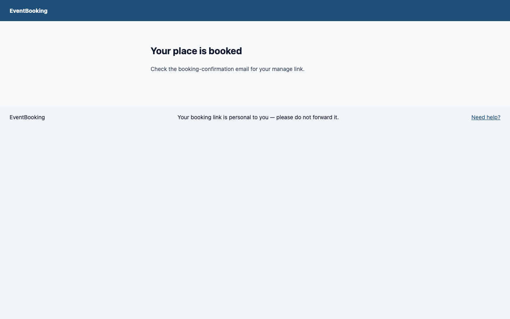
*Place booked.*

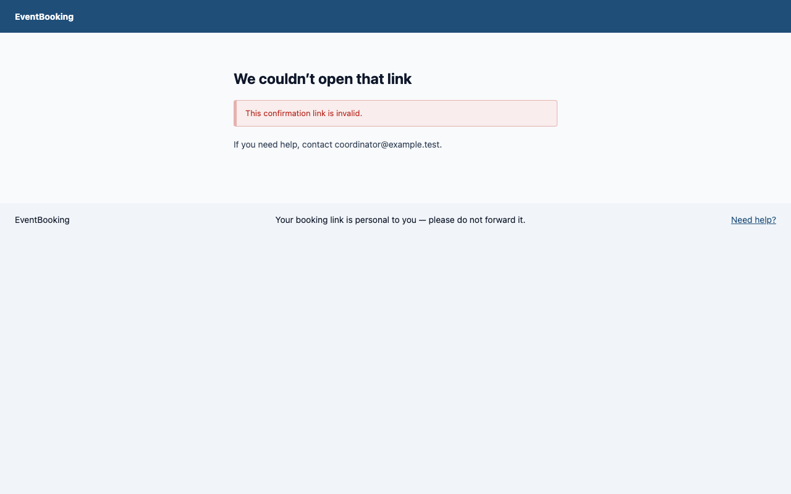
*Invalid confirmation link.*

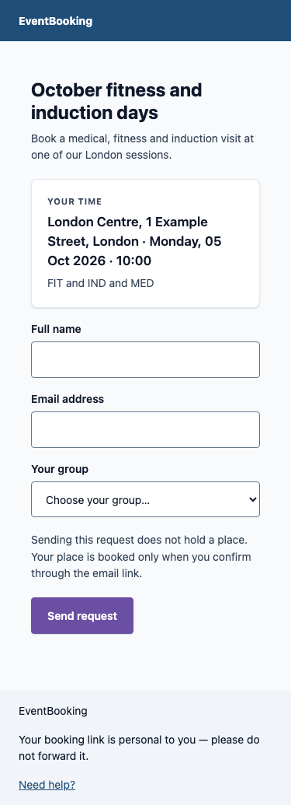
*Request form at 375 px wide.*

**Result:** Pass / Fail / Blocked / Not run

**Device, outcome and evidence:** ____________________
